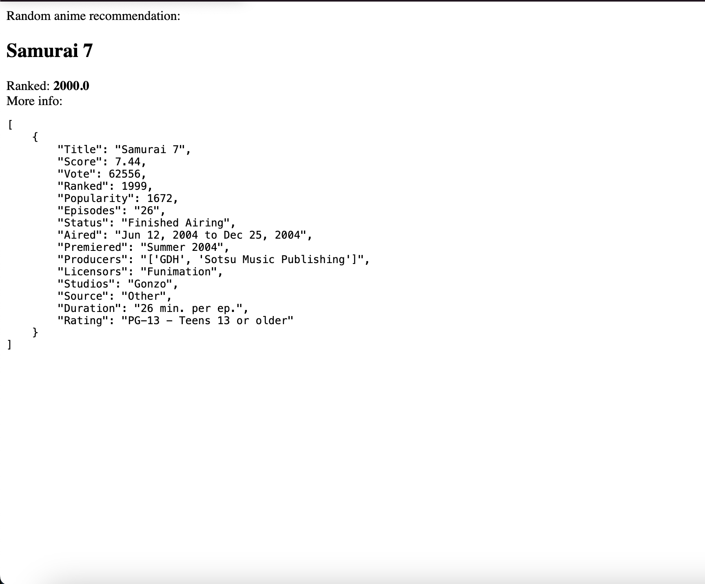
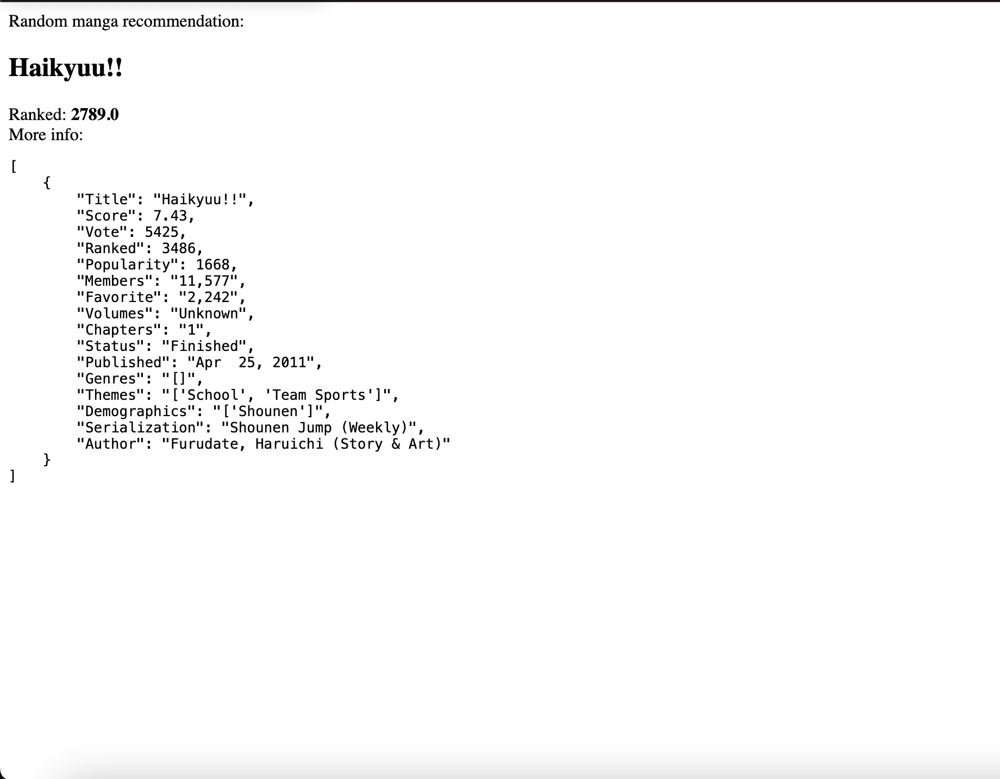

# Anime and Manga Dataset Analysis
## (and Random Generator Recommendation)
## Project Overview
This project involves the analysis of anime and manga datasets obtained from MyAnimeList, using weighted averages on various metrics to determine rankings. Additionally, a random generator has been added to recommend anime and manga, which outputs randomly selected title along with its ranking based on calculated weighted averages.

### Anime Analysis
- Anime titles are ranked based on weighted averages, considering both the Score and total number of votes.
- Top anime studios are also ranked based on their scores and total number of votes.
- Random anime from anime generator:

### Manga Analysis
- Manga titles are ranked using weighted averages that consider the score, total number of votes, favorites, and number of members.
- Top manga publishers are ranked based on score, total number of votes, favorites, and number of members.
- Random manga from manga generator:

## Random Generator
The [Random Generator](random_generator.py) module has been created to generate random anime and manga recommendations. It outputs a randomly selected title and provides its rank, determined through the weighted averages calculations.
