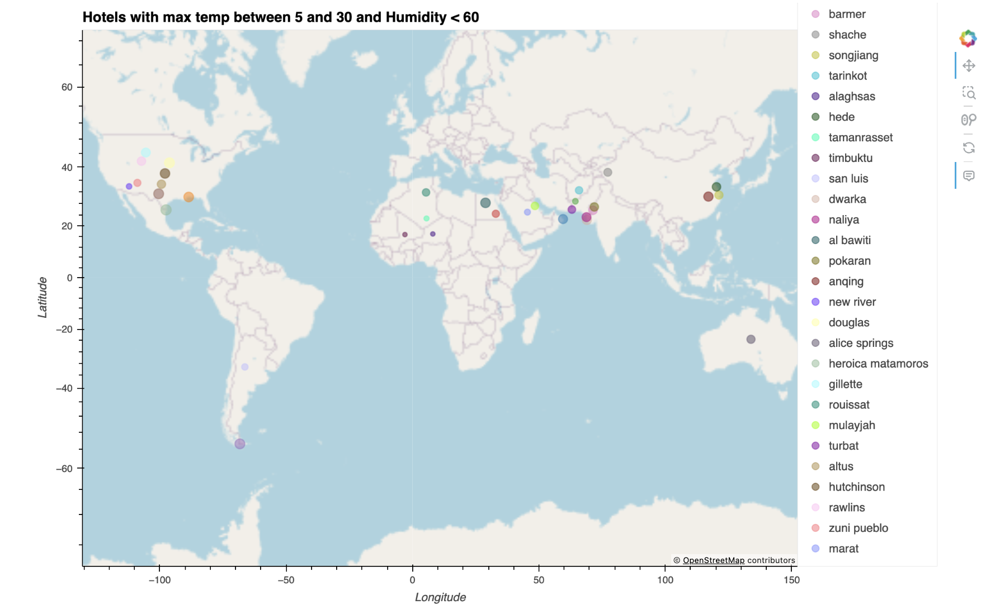

# Python APIs - WeatherPy and VacationPy

## Summary
This WeatherPy repository explores the relationship between weather variables and latitude using Python's capabilities in handling requests, working with APIs, and traversing JSON data. The project is divided into two parts: WeatherPy and VacationPy.

## Data Sources

- Utilizes the citipy library and the OpenWeatherMap API to gather weather data from over 500 cities.
- Geographic coordinates are randomly generated to ensure a diverse dataset.
- Geoapify API is employed in VacationPy to find hotels near selected cities.

### [Weather](WeatherPy.ipynb)
- [WeatherPy.ipynb](WeatherPy.ipynb)
#### Process
- Create scatter plots showcasing relationships between latitude and temperature, humidity, cloudiness, and wind speed.
- Compute linear regression for each relationship, differentiating between Northern and Southern Hemispheres.
#### Conclusions
- In the weather correlation, the most obvious(and expected) correlation is in the temperature vs. latitude correlation, where the max temperature increases towards the equator and decreases away from the equator. 
- There is no obvious correlation in humidity.
- While there is no obvious correlation in windspeed and cloudiness, the linear regression suggests that there is an increase in humidity towards the equator and a decrease in windspeed.

### [Vacation Hotels](VacationPy.ipynb):
- [VacationPy.ipynb](VacationPy.ipynb)
- Uses weather data to plan future vacations, employing Jupyter notebooks, geoViews Python library, and the Geoapify API.
- Generates a map displaying cities with point sizes representing humidity.
- Narrows down cities based on user-defined ideal weather conditions.
- Creates a new DataFrame to store hotel information and uses Geoapify API to find the nearest hotel for each city.
- Displays hotel names and countries in the map's hover message.
#### Conclusions
- For the hotels, the ideal weather conditions were set to a max temp between 5 and 30 C and Humidity less than 60.

---
Implementation Highlights:
Incorporates efficient Git practices, including a .gitignore file to protect sensitive API keys.
Encourages critical thinking to address potential bias in the dataset selection.
