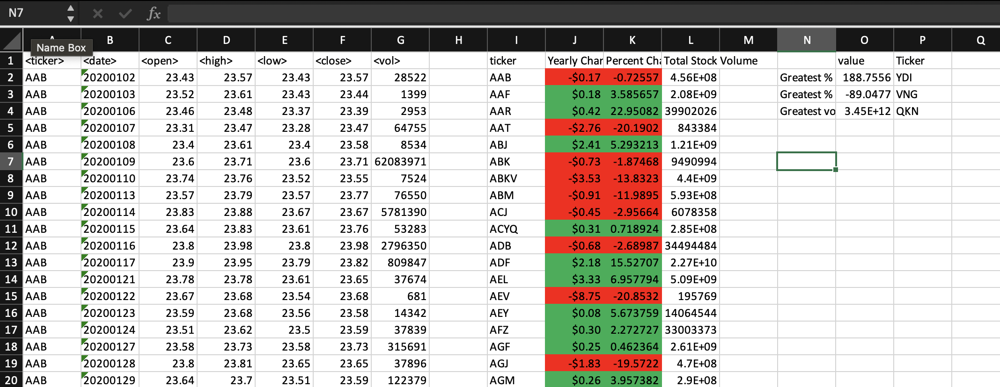
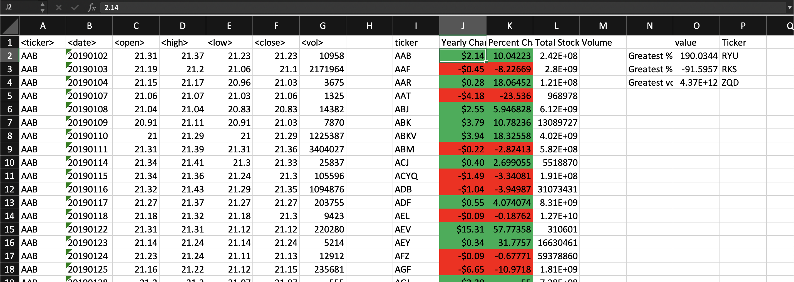
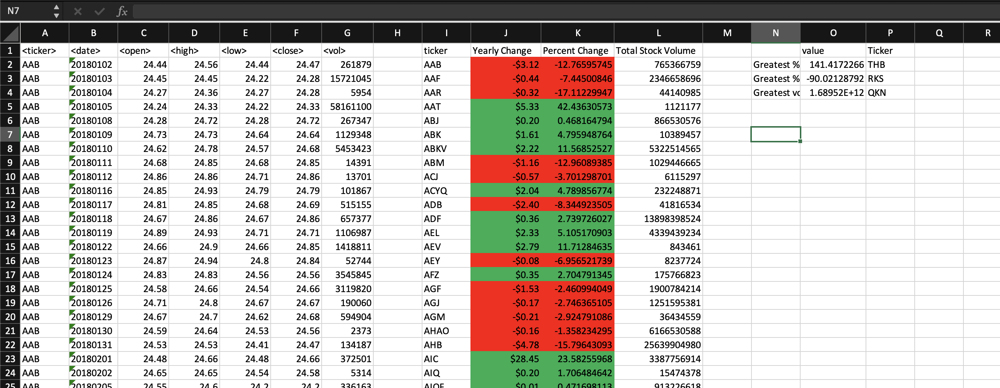

# Calculating historical stock market data in VBA
The following [VBA code](vba_script_assign_2.bas) takes a large dataset consisting of historical stock market data and calculates the yearly change, percent change and total stock volume for each ticker. Additionally, it also calculates the ticker with the greatest % increase, the greatest % decrease and the greatest stock volume. 

