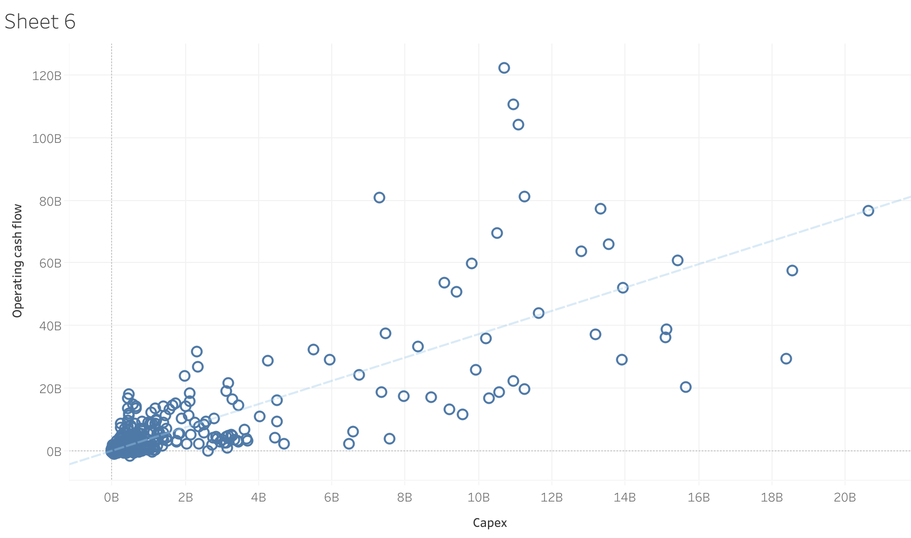
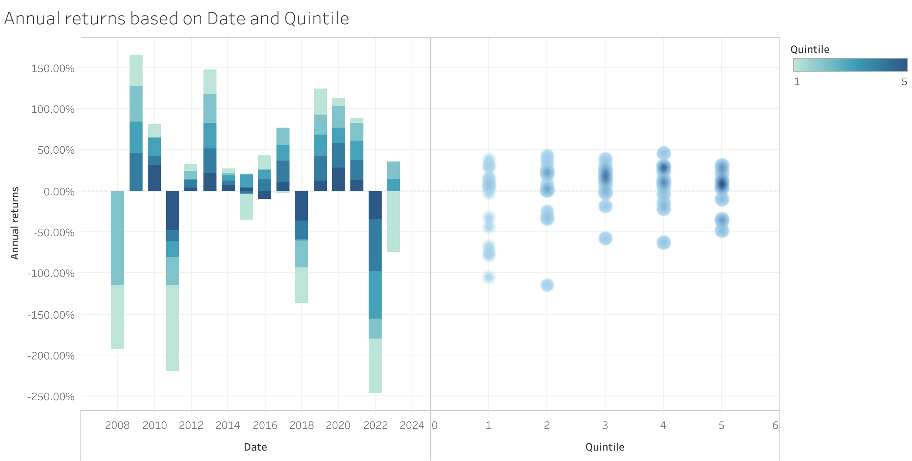
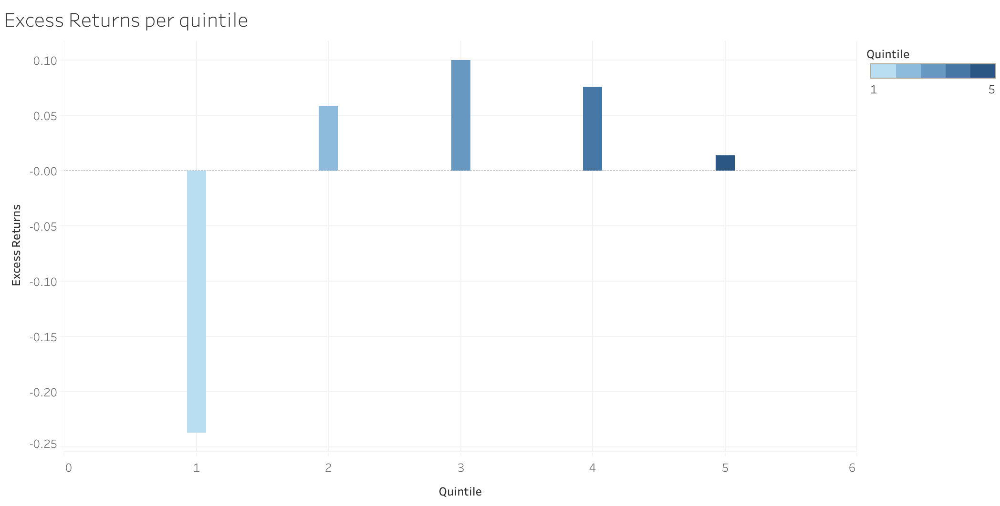

# Case study: A data-driven investment analysis

## Introduction
The purpose of this analysis is to explore variables of the financials of stocks to determine best ratios that result with low volatility and good returns, with the aim of enhancing portfolio development. The structure of this study is heavily infulenced by the methodology used in [Quantative Stratagies for Measuring Alpha](https://www.amazon.ca/Quantitative-Strategies-Achieving-Alpha-McGraw-Hill-ebook/dp/B001JKV93W/ref=tmm_kin_swatch_0?_encoding=UTF8&qid=&sr=)(1). Specifically, we will look at Cash Flow factors, namely <ins>Operating Cash Flow and Capex</ins>. For a company to be considered a good investment, solid earnings are essential. We will use the ratio Operating Cash Flow to Capex, to determine what the optimal ratio is that yields high returns. Note that this is not necessarily a standalone strategy, rather, it's purpose is to determine how the management of cash affects overall returns. The results from this analysis, paired with other relavant stratagies, can contribute to the development of a strong portfolio.

### Common Screeners

What makes a stock price appreciate? The most common ways to value a stock are P/E (price/earnings), EV/EBITDA (enterprise value/EBITDA) and FCF/Market Capitalization (or Free Cash Flow yield). In order to narrow down the factors to Operating Cash Flow and Capex, sevaral other variables were taken into account. Some common variables used in screeners today are: P/E, ratio, P/B ratio, FCF, EV/EBITDA, Market Cap, Dividend Yield, ROE, etc. 

These metrics are well known, and are good indicators of the performance of a stock. This project aimed to test the efficiency of the use of cash in a companies expenditures, in comparison to the free cash flow. 

### Operating cash flow to Capital Expenditures
In the daily operations of a business, a certain level of expenditures is required to replace a companies PP&E expenses. The operating cash flow looks at the amount of cash available in a company to fund its PP&E expenditures relative to it's cash flow. Companies that have a high cash flow relative to their capex are generally more stable, have less debt, and have enough cash on hand to pay off their expenses. On the other hand, companies with little cash flow to capex may not have the financial flexibility to improve upon their performance. 

## Methodology
1. Data Gathering:
- The dataset used is from the [IEX cloud](https://iexcloud.io/docs)(2) API database.
- Stocks are gathered from [NASDAQ](https://www.nasdaq.com/market-activity/stocks/screener)(3) database and filtered to the **tech** industry, since 2008.

2. Ranking Stocks:
- For each year, the the stocks are ranked based on the operating cash flow to capex ratio.

3. Quintile assignment:
- The ranked list is then divided into quintiles, where the first quntile has the highest ratios of Operating Cash Flow to Capex and the fifth quintile has the lowest ratios.

4. Analysis:
- The returns based on the historical data is calculated for each quintile. 
- The % change in closing prices is calculated annually, for each stock. 
- The excess return compared to the universe is also calculated for comparison.

## Results
- In a preliminary analysis, we can also see a linear relationship between Operating Cash Flow and Capex, which makes sense as a certain amount of cash is needed to attribute to PP&E.

- The resulting graphs look at the quintiles with respect to the their yearly performance, volatility in returns, as well as excess returns.

## Analysis
When we look at the excess returns, we see that quintile 1 has the poorest performance, with an average excess return of -23.7%. These are the stocks with the highest Operating Cash Flow to Capex values. Paired with a high volatility, we can conclude that we can conclude that stocks with higher Operating Cash Flow to Capex are likely not stable, and will not be a good choice for portfolios. In contrast, Quintile 3 has high excess returns with overall lower volatility, and we can conclude these stocks are likely the best to invest in, and the most stable. The average Operating Cash Flow to Capex ratio in quintile 3 is $20.29 \pm 5.46$ %. From this we can conclude that stocks that have 1.2x operating cash flow relative to their capex.

We should also note that quintiles 2, 4, and 5 also yield good returns, and paired with other strategies and industries, will be useful in determining the returns of such stocks.

## Limatations
- Metrics can be industry specific. In this study, we have only taken into account metrics from the tech industry.
- Some stocks do not have data for as long as others

## Conclusion
In conclusion, the Operating Cash Flow to Capex ratio is a valuable metric for assessing a company's financial health. While Quintile 1 showed poor excess returns, its stability makes it an interesting area for further investigation. The findings contribute to a nuanced understanding of the relationship between cash management and stock performance, offering insights for constructing a resilient investment portfolio.

## References
[1.] (Quantative Stratagies for measuring Alpha)
[2.] [IEX cloud](https://iexcloud.io/docs)
[3.] [NASDAQ](https://www.nasdaq.com/market-activity/stocks/screener)
[4.] [Hedge fund Case study](https://www.streetofwalls.com/finance-training-courses/hedge-fund-training/hedge-fund-case-study-1-page/)
