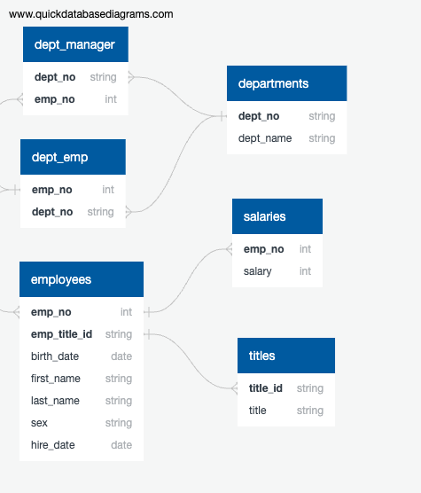

# a7-sql-challenge
The database diagram for the data files is structured as follows

## Data Engineering
- Created table schemas for each CSV file ensuring:
  - Definition of all required columns
  - Correct data types and lengths for columns
  - Setting primary keys and ensuring uniqueness
  - Establishing relationships between tables using foreign keys
  - Handling NULL values appropriately
- Imported CSV data into corresponding SQL tables.

## Data Analysis
Performed various queries on the database to derive insights, including:
- Employee number, last name, first name, sex, and salary for each employee.
- First name, last name, and hire date for employees hired in 1986.
- Managers of each department with department details.
- Department numbers for each employee along with their details.
- Employees named Hercules with last names beginning with 'B'.
- Employees in the Sales department.
- Employees in Sales and Development departments.
- Frequency counts of employee last names.

